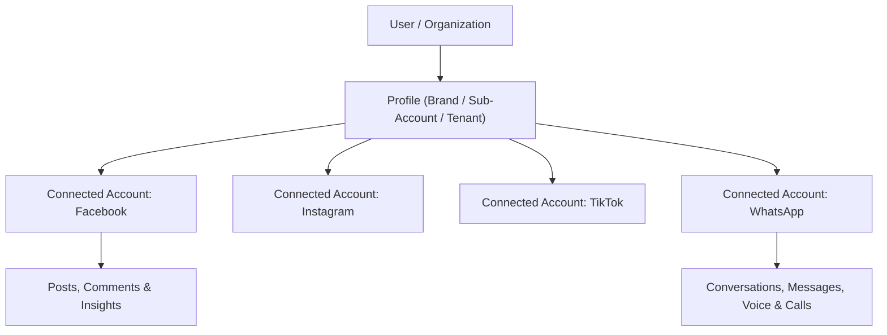

# Zernio Full Documentation Index & Architecture Guide

This comprehensive reference document catalogs the entirety of the Zernio API and Platform documentation scraped and saved directly in `docs/zernio/llms-full.txt` (7.15 MB, 154,482 lines) and `docs/zernio/llms-summary.txt` (414 KB, 4,989 lines).

---

## 1. Core Architecture & Fundamentals

### Authentication & Keys
- **Base URL**: `https://zernio.com/api/v1`
- **Header**: `Authorization: Bearer sk_<64_hex_characters>`
- **Environment Variable**: `ZERNIO_API_KEY`
- **SDKs Supported**: Node.js (`@zernio/node`), Python (`zernio`), cURL, Go, Ruby, Java, PHP, .NET, Rust.

### Multi-Tenancy Hierarchy


- **Profile**: Multi-tenant boundary isolating connected accounts. Every profile ID is a 24-character hexadecimal ID (`_id`).
- **Account**: Specific connected social profile or channel token.

---

## 2. Exhaustive Section & Module Catalog

The complete documentation contains **893 distinct page modules** spanning 58 specialized functional domains:

| Category / Domain | Endpoints / Pages | Description |
| :--- | :--- | :--- |
| **Platforms (16 Networks)** | 113 pages | Bluesky, Discord, Facebook, Instagram, LinkedIn, OpenAI Ads, Pinterest, Pinterest Ads, Reddit, Shopify Blogs, Slack, Snapchat, Telegram, Threads, TikTok, TikTok Ads, X / Twitter, X Ads, YouTube. |
| **WhatsApp Business API** | 75 pages | Cloud API, templates, business profiles, media messages, interactive components, flow endpoints. |
| **Meta Business Agent** | 55 pages | AI agent orchestration on connected WhatsApp numbers directly through Zernio without opening Business Manager. |
| **Connect / OAuth Flows** | 55 pages | Hosted OAuth authorization URLs, headless connection, account switching, reconnection webhooks. |
| **Advertising Campaigns & Structure** | 51 pages | Campaigns, ad sets, ads, bid optimization, Advantage+ budget, schedules across Meta, TikTok, Pinterest, X. |
| **Ad Accounts & Ops** | 46 pages | Ad account funding, audits, A/B studies, DSA compliance, Business Manager connections. |
| **Phone Numbers** | 28 pages | Number procurement (PSTN, Toll-Free, Mobile), regulatory compliance, KYC, e911, CNAM. |
| **Posting Analytics** | 26 pages | Metrics, follower demographics, impressions, reach, content decay, optimal posting hours. |
| **Google Business Profile** | 25 pages | Locations, reviews, replies, Q&A, business hours, updates, local posts. |
| **Discord API Integration** | 24 pages | Server webhooks, channel routing, dynamic avatar/name overrides, role mentions, forum posts. |
| **SMS & MMS** | 22 pages | Outbound/inbound messaging, shortcodes, 10DLC brand & campaign registrations, carrier opt-outs. |
| **Voice & Calling** | 18 pages | WebRTC/PSTN call initiation, inbound SIP routing, call recording, IVR trees. |
| **Ad Creatives** | 18 pages | Ad creative library, dynamic carousel asset sets, previews, catalog integration. |
| **Inbox & Messaging** | 16 pages | Unified inbox across 16 networks (DMs, Messenger, IG Direct, Telegram, WhatsApp). |
| **Comments** | 15 pages | Unified post comment moderation, replies, hides, likes across Facebook, Instagram, YouTube, TikTok. |
| **Webhooks** | 15 pages | Realtime incoming event delivery (post delivery, status, incoming DMs, comment creation). |
| **Accounts** | 15 pages | Account connection, profile binding, capability discovery, token refresh, disconnection. |
| **Conversions API** | 14 pages | Server-Side Conversions (CAPI) for Meta, TikTok, Google, Pinterest, and LinkedIn with hashed PII matching. |
| **Workflows** | 14 pages | Graph-based conversational automations, trigger evaluation, branch condition checks, agent handoffs. |
| **Blogs** | 10 pages | Multi-platform blogging (Shopify, WordPress, Webflow) article creation, scheduling, formatting. |
| **Posts & Publishing** | 10 pages | Multi-network cross-posting, video encoding, carousel formatting, draft queues, schedule triggers. |
| **Tracking Tags & Pixels** | 10 pages | Pixel lifecycle, tag installations, audience association, event diagnostics. |
| **Broadcasts & Drip Sequences**| 20 pages | Bulk outbound campaigns, user segment enrollment, schedule delays, unsubscribes. |
| **Contacts & Custom Fields** | 13 pages | Unified CRM database, conversation tracking, contact property metadata. |
| **Ad Audiences & Targeting** | 11 pages | Custom audience hashing, lookalikes, interest/geo search, demographic facets. |
| **Security & Developer** | 21 pages | API key rotation, IP allowlisting, idempotency keys, rate limit headers, audit logging. |

---

## 3. Quick Reference API Examples

### 3.1 Node.js Quickstart
```javascript
import Zernio from '@zernio/node';

const zernio = new Zernio({
  apiKey: process.env.ZERNIO_API_KEY, // Or pass explicitly
});

// 1. Create Profile
const profile = await zernio.profiles.create({ name: "Primary Brand" });

// 2. Generate Connect URL
const connect = await zernio.connect.getAuthUrl({
  platform: "facebook",
  profileId: profile._id,
  redirectUrl: "https://your-app.com/callback"
});

// 3. Publish / Schedule Post
const post = await zernio.posts.create({
  profileId: profile._id,
  accountIds: ["65f1234567890abcdef12345"],
  content: "Automated post across social networks via Zernio!",
  mediaUrls: ["https://example.com/banner.jpg"],
  scheduledFor: "2026-09-15T12:00:00Z"
});

console.log(`Scheduled post: ${post._id}`);
```

### 3.2 Python Quickstart
```python
import os
from zernio import Zernio

client = Zernio(api_key=os.environ["ZERNIO_API_KEY"])

# 1. Fetch connected accounts
accounts = client.accounts.list(profile_id="65f1234567890abcdef12345")

# 2. Reply to an inbox comment
reply = client.comments.reply(
    comment_id="comment_78910",
    message="Thanks for reaching out! We will assist you shortly."
)
```

### 3.3 cURL Post with Idempotency
```bash
curl -X POST https://zernio.com/api/v1/posts \
  -H "Authorization: Bearer $ZERNIO_API_KEY" \
  -H "Content-Type: application/json" \
  -H "Idempotency-Key: post_req_987654321" \
  -d '{
    "profileId": "65f1234567890abcdef12345",
    "accountIds": ["65f9876543210fedcba54321"],
    "content": "Multi-platform scheduled update #automation",
    "publishNow": true
  }'
```

---

## 4. Local File Reference

The raw documentation files containing every single code sample, curl command, schema parameter, and response payload are permanently archived at:
- **Comprehensive Docs**: [`docs/zernio/llms-full.txt`](file:///D:/pRoG/facebook-comment-agent-/docs/zernio/llms-full.txt) *(154,482 lines)*
- **API Map & Page Index**: [`docs/zernio/llms-summary.txt`](file:///D:/pRoG/facebook-comment-agent-/docs/zernio/llms-summary.txt) *(4,989 lines)*
